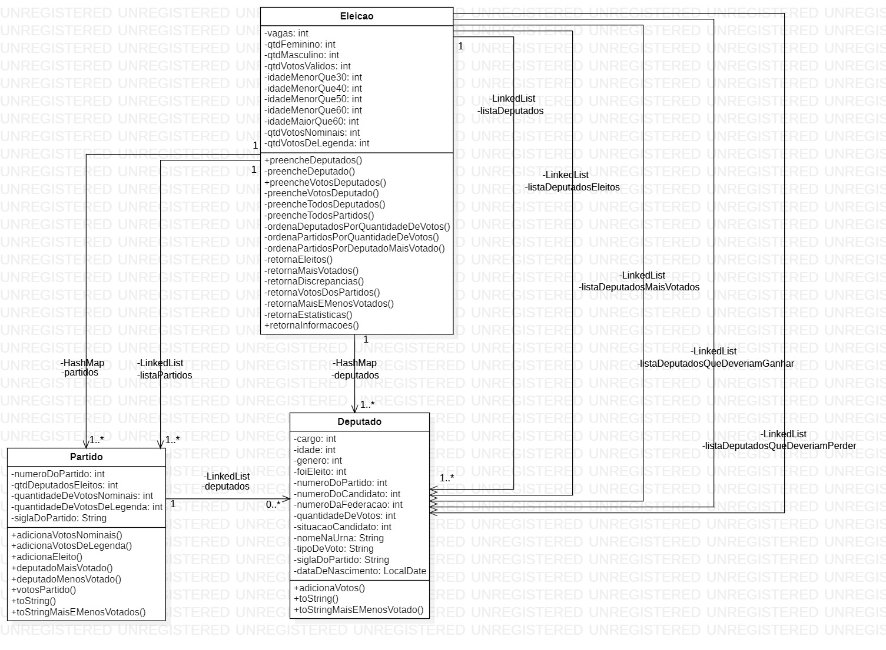

<h1>Sistema Eleitoral Brasileiro</h1>
<h5>Feito por João Victor Morais e Talles Weiler (UFES)</h5>

<h3>Introdução:</h3>

Projeto de processamento de dados do sistema eleitoral brasileiro utilizando conceitos de programação orientada a objetos e estruturas de dados. O principal objetivo é contabilizar os partidos, os candidatos e os votos das eleições estaduais e federais de todos os estados brasileiros.

<h3>Utilização do programa:</h3>

O programa é compilado utilizando o <b>Apache Ant</b> através de um <b>build.xml</b>. Suas principais funções são:

- <b>ant compile:</b> o código-fonte é compilado, gerando os arquivos <b>.class</b> para todas as classes do trabalho.
- <b>ant jar:</b> os arquivos <b>.class</b> são empacotados em um arquivo <b>.jar</b>.
- <b>ant run-federal:</b> o programa é executado especificando --federal, os arquivos candidatos.csv e votacao.csv e a data 02/10/2022 como parâmetros.
- <b>ant run-estadual:</b> o programa é executado especificando --estadual, os arquivos candidatos.csv e votacao.csv e a data 02/10/2022 como parâmetros.
- <b>ant clean:</b> todos os arquivos gerados (classes compiladas) e eventuais arquivos de entrada de dados são excluídos, sobrando somente o conteúdo original do arquivo compactado (ou seja, o código-fonte e o arquivo de build).

<h3>Implementação do código:</h3>
<h5>Diagrama de classes:</h5>

Para fins de otimização, utilizamos dois hashmaps ("deputados" e "partidos") durante toda a leitura dos arquivos, para facilitar a inserção dos votos contabilizados. Após a leitura, utilizamos diversas listas para ordenar os deputados/partidos nos diversos critérios solicitados no relatório. Por fim, transformamos todos esses resultados obtidos em uma string e retornamos para o <b>App</b>, onde é impresso no terminal.  
<b>Eleicao</b> é nossa classe principal e a única utilizada no <b>App</b>. Ela possui somente três métodos públicos:

- <b>preencheDeputados()</b>
- <b>preencheVotosDeputados()</b>
- <b>retornaInformacoes()</b>

As classes <b>Deputado</b> e <b>Partido</b> possuem diversos métodos e atributos tanto públicos quanto privados que estão documentados ao longo do código. Essas classes somente são utilizadas dentro da classe <b>Eleicao</b>, assim um programa cliente (em nosso caso <b>App</b>) não tem acesso a elas.

<h3>Testes realizados:</h3>

Foram utilizados para testes os seis casos fornecidos pelo professor (Acre, Alagoas, Espirito Santo, Minas Gerais, Pernambuco e Rio Grande do Sul), além de outros arquivos encontrados nos links:

- https://cdn.tse.jus.br/estatistica/sead/odsele/consulta_cand/consulta_cand_2022.zip> (candidatos)
- https://cdn.tse.jus.br/estatistica/sead/odsele/votacao_secao/votacao_secao_2022_SP.zip (votacao)

Rodamos todos os estados e em nenhum deles ocorreu algum erro, porém só comparamos as saídas com os casos fornecidos pelo professor. Além disso fizemos e testamos alguns tratamentos de erros, como falha ao abrir arquivos ou argumentos insuficientes para o funcionamento do programa, todos esses erros são devolvidos para o App e é printada uma mensagem na tela especificando o ocorrido.

<h3>Bugs conhecidos e resolvidos:</h3>

- <b>Voto de legenda:</b> em algumas regiões os votos de legenda não eram totalmente contabilizados (o bug foi resolvido durante a alteração da eficiência do código, porém não se sabe ao certo o que resolveu o problema).

- <b>Voto em pessoa indeferida porém não anulada:</b> em raros casos existia um voto em um candidato não deferido que não estava anulado no arquivo do TSE (o bug foi resolvido simplesmente ignorando o voto quando não existe nem partido e nem candidato com aquele número votável).

- <b>Leitura ineficiente dos arquivos:</b> nas primeiras versões do programa, todas as linhas eram lidas, além de serem scaneadas por cada pedaço delas, ocasionando um tempo de execução muito alto, como por exemplo minas gerais, que demorou três minutos para gerar a saída (o bug foi resolvido ao ler a linha inteira de uma vez e usar a função split, realizando nossas análises somente quando os requisitos eram cumpridos).

- <b>Tempo de execução:</b> nas primeiras versões do programa, tudo era feito em listas, o que tornava o acesso para contabilização de cada voto muito lento (o bug foi resolvido utilizando-se hashmaps, criando listas somente quando fosse necessário ordenar as informações).

- <b>Erros bobos:</b> além disso, durante todo o processo de produção do código, diversos erros muito simples foram surgindo, como falta de parâmetros, alguns "if" esquecidos, entre outros (os bugs foram corrigidos relendo o código com paciência).

